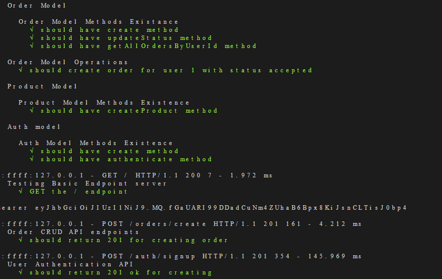

## Intro

DAF backend coding task.

:one: The applicaiton is **unit** and **integration** tested using jasmine <br>
:two: The application is built on top of `NodeJs`, `Express`, and `PostgreSQL`, I've not used any ORM, it's a pure raw sql.
:three: Login/Signup are using JWT authentication

## project structure

```
📦src
 ┣ 📂controllers
 ┃ ┣ 📜auth.controller.js
 ┃ ┣ 📜order.controller.js
 ┃ ┗ 📜product.controller.js
 ┣ 📂database
 ┃ ┗ 📜database.init.js
 ┣ 📂middlewares
 ┃ ┣ 📜auth.js
 ┃ ┗ 📜jwt.js
 ┣ 📂models
 ┃ ┣ 📜Order.model.js
 ┃ ┣ 📜Product.model.js
 ┃ ┗ 📜User.model.js
 ┣ 📂routes
 ┃ ┣ 📜auth.routes.js
 ┃ ┣ 📜order.routes.js
 ┃ ┣ 📜product.routes.js
 ┃ ┗ 📜user.routes.js
 ┣ 📂utils
 ┣ 📜app.js
 ┗ 📜index.js
```

## DB Diagram


## DB_SQL

[DB_SQL](./screenshots/db.sql)

## API endpoints

### Auth

| method | endpoint | action | params |
| --- | ---- | --- | -- |
| POST | /auth/signup | signup user | - |
| POST | /auth/login | login user | - |

### Order

| method | endpoint | action | params | query params |
| --- | ---- | --- | -- | -- |
| POST | /orders/create | create new order | - | - |
| POST | /orders/:orderId/products/:productId | add product to an order | orderId, productId | - |
| GET | /orders/users/:userId/ | get user's orders | userId | - |
| PUT | /orders/:orderId/ |  change order status | orderId | status |

### Product

| method | endpoint | action | params | query params |
| --- | ---- | --- | -- | -- |
| POST | /products/create | create new product | - | - |

## Installing

Install the project dependencies

```bash
npm install
```

## Setup and Connect to database

1. **creating user**

```sh
CREATE USER daf_user WITH PASSWORD 'password123';
```

2. **create both development and testing db**

```sh
CREATE DATABASE daf;
CREATE DATABASE daf_test;
```

3. **grant all privileges on both databases**

```sh
\c daf;
GRANT ALL PRIVILEGES ON DATABASE DAF To daf_user;
\c daf_test 
GRANT ALL PRIVILEGES ON DATABASE DAF_test To daf_user;
```

- setting enviroment variables

```sh
touch .env
nano .env

## place the enviroment variables below inside the .env file
# .env
APP_PORT=3000
POSTGRES_HOST=localhost
POSTGRES_USER=daf_user
POSTGRES_DB=daf
POSTGRES_PASSWORD=password123
POSTGRES_TEST_DB=daf_test
ENV=dev
BCRYPT_PASS=thisissupersecretpassword
SALT_ROUNDS=10
PEPPER=password
JWT_SECRET_KEY=thisissupersecretpassword
```

- port of the posgres database server
`5432`
- port of the backend:
the server runs <a href="http://localhost:3000">localhost</a>

## Running application

- to run the application

```sh
npm run dev
```

## Running Tests

To run tests, you need only two steps

1. Export ENV to test

```sh
export ENV=test
```

2. Run testing command, which will set the ENV to test if you've forgotten to do the first step, and will run the testing database migrations, then running the test suits

```sh
npm run test
```

## Avaiable scripts

```sh
npm run migrate # running testing migrations
npm run jasmine # running jasmine for testing
npm run migrate-down # down the migrations
npm run dev # run the application
```

## Tests passed ✅



## Logs

- [x] :rocket: Signup
- [x] :rocket: Login
- [x] :rocket: accept/reject order
- [x] :rocket: create order
- [x] :rocket: get user order
- [x] :rocket: add product to order
- [x] :rocket: setup testing
  - [x] Unit testing
  - [x] Integration testing
